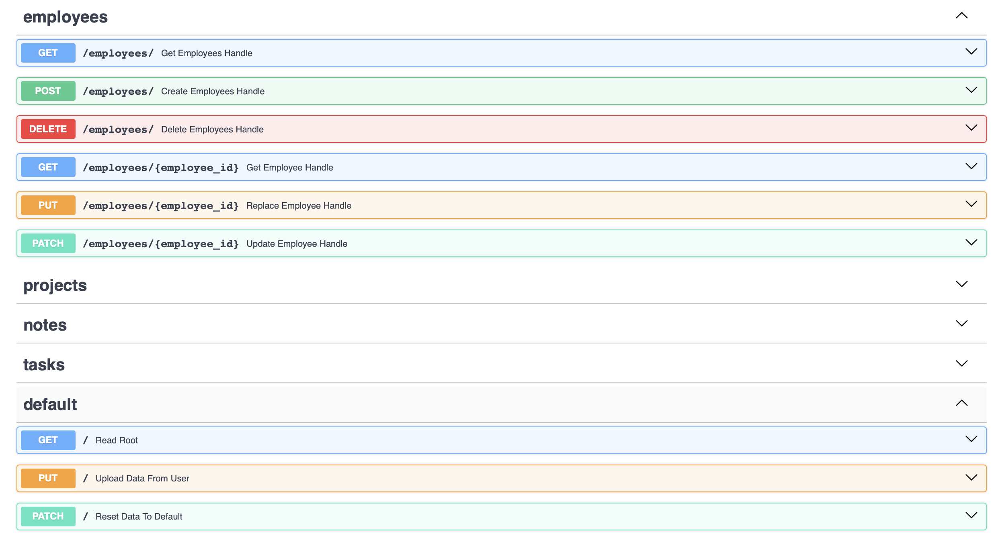
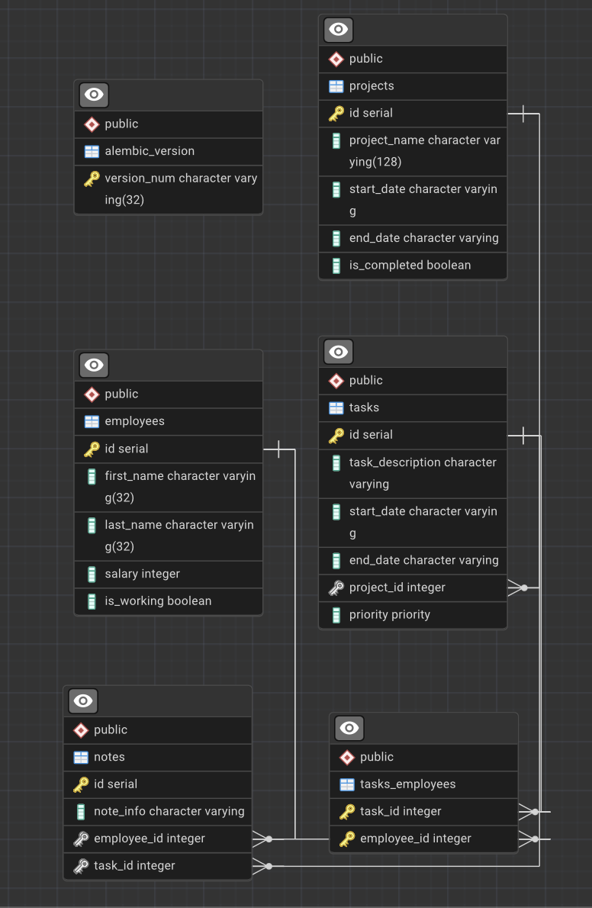

# 🚀 FastAPI Асинхронный Бэкенд Проект

[English](#-fastapi-asynchronous-backend-project) | **Русский**

Высокопроизводительное асинхронное бэкенд-приложение с современным стеком технологий и полным циклом разработки.

## 🖼️ Project Demo

### API Documentation

*Интерактивное API документация со всеми эндпоинтами*

### Database Schema

*PostgreSQL схема показывающиеся все связи*

### Key Features
 # авторизация
 # показать как работают связи при вызове одного
 # Возможность загружать собственные данные

### 🚀 Quick Local Setup
```bash
git clone https://github.com/Emin-07/Project-Handler.git
make run
# App runs on http://localhost:8000
# API docs: http://localhost:8000/docs 
# API alternative docs: http://localhost:8000/redoc 

```


## 🛠 Технологический стек

**Бэкенд:**
- **Python 3.13** - Основной язык программирования
- **FastAPI 0.116** - Современный асинхронный фреймворк
- **SQLAlchemy 2.0** - Асинхронный ORM
- **Alembic** - Миграции базы данных
- **Pydantic & Pydantic Settings** - Валидация и конфигурация
- **Uvicorn** - ASGI сервер

**База данных:**
- **PostgreSQL** - Основная реляционная БД
- **AsyncPG** - Асинхронный драйвер PostgreSQL
- **Psycopg2** - Дополнительный драйвер БД

**Инфраструктура:**
- **Docker & Docker Compose** - Контейнеризация и оркестрация
- **UV** - Современный менеджер зависимостей
- **Pytest** - Фреймворк для тестирования
- **HTTPX** - Асинхронные HTTP клиенты

**Инструменты разработки:**
- **Ruff** - Молниеносный линтер
- **Mypy** - Статическая проверка типов
- **Black** - Форматирование кода
- **Pre-commit** - Git hooks

## 🚀 Быстрый старт

### Предварительные требования
- Docker & Docker Compose
- UV (рекомендуется) или Python 3.13+

### Запуск через Docker (Рекомендуется)
```bash
# Клонировать репозиторий
git clone https://github.com/Emin-07/Project-Handler.git
cd projectHandler

# Запустить все сервисы
make run

# Приложение FastAPI будет доступно по http://localhost:8000
# Приложение Adminer будет доступно по http://localhost:8080
# Приложение pgadmin будет доступно по http://localhost:5050

```

### Локальная разработка с UV
```bash
# Установить UV (если не установлен)
curl -LsSf https://astral.sh/uv/install.sh | sh

# Клонировать и настроить
git clone https://github.com/Emin-07/Project-Handler.git
cd projectHandler

# Установить все зависимости
uv sync --all-extras

# Сгенерировать requirements файлы
make requirements

# Запустить сервер разработки
uvicorn main:app --reload --host 0.0.0.0 --port 8000
```

### Традиционный способ (pip)
```bash
# Сгенерировать requirements.txt
make requirements

# Создать виртуальное окружение
python -m venv venv
source venv/bin/activate

# Установить зависимости
pip install -r requirements.txt
pip install -r requirements-dev.txt


# Запустить сервер
uvicorn app.main:app --reload --host 0.0.0.0 --port 8000
```

## 📡 API Эндпоинты

### Основные endpoints:
- `GET /health` - Проверка работоспособности API
- `GET /docs` - Интерактивная документация Swagger
- `GET /redoc` - Альтернативная документация

### Особенности API:
- ✅ **Полностью асинхронные операции**
- ✅ **Автогенерация документации OpenAPI**
- ✅ **Валидация данных через Pydantic v2**
- ✅ **JWT аутентификация**
- ✅ **Пагинация и фильтрация**
- ✅ **Обработка ошибок и валидация**

## 🧪 Тестирование

```bash
# Запуск всех тестов
make test


# Запуск конкретного теста
pytest tests/ -v -k "test_function_name"
```

**Покрытие тестами:**
- Модульные тесты (Unit tests)
- Интеграционные тесты с базой данных
- Тесты API эндпоинтов
- Асинхронные тесты (pytest-asyncio)

## 🗄 Структура проекта

```
project/
├── src/
│   ├── routers/         # Роутеры и endpoints
│   ├── database/        # Задачи относящиеся к базе данных
│   │   ├── connections/ # SQLAlchemy модели БД, Конфиг БД и сетап БД
│   │   ├── queries/     # Запросы написаны на SQLAlchemy ORM для взаимодейcтвия с БД
│   ├── schemas/         # Pydantic схемы для валидации
│   └── tests/           # Тесты
├── migrations/          # Alembic миграции
├── README.md            # Readme для GitHub
├── env.example          # Пример .env файла который поможет вам в настройке окружения
├── test_data.json       # Дата для теста ручек
├── user_data.json       # Дата для работы с ручками, данная юзером
├── prestart.sh          # Файл запускающийся в докерфайле, он обновляет миграции до Head
├── main.py              # Файл содержащий root endpointы, и связывающий routerы
├── pytest.ini           # Настройки для pytest (тестинга)
├── alembic.ini          # Настройки для alembic (миграции)
├── uv.lock              # Файл который следит за всеми зависимостями
├── .gitignore           # Файл позволяющий игнорировать ненужные файлы при коммите
├── docker-compose.yml   # Docker конфигурация
├── Dockerfile           # Образ приложения
├── pyproject.toml       # Зависимости UV
├── requirements.txt     # Автогенерируемые зависимости
├── requirements-dev.txt # Автогенерируемые зависимости для dev
└── Makefile             # Утилиты разработки
```

## 🔧 Настройка окружения

Создайте `.env` файл:

# Linux/Mac
cp .env.example .env

# Windows (Command Prompt)
copy .env.example .env

```env
DB_HOST=localhost
DB_PORT=5433
DB_USER=postgres
DB_PASSWORD=postgres
DB_NAME=project_handler
```

## 👨‍💻 Разработка

### Управление зависимостями
```bash
# Добавить новую зависимость
uv add package_name

# Добавить dev зависимость
uv add --dev package_name

# Обновить requirements файлы
make requirements
```

### Миграции базы данных
```bash
# Создать новую миграцию
alembic revision --autogenerate -m "description"

# Применить миграции
alembic upgrade head

# Откатить миграцию
alembic downgrade -1
```

### Code Quality
```bash
# Запуск линтера и форматирование
ruff check .
ruff format .

# Проверка типов
mypy app/
```

### Утилиты Makefile
```bash
make requirements       # Скачивание всех зависимостей, как dev так и prod
make requirements-prod  # Скачивание prod зависимостей
make requirements-dev   # Скачивание dev зависимостей
make run                # Запуск через Docker-compose
make test               # Запуск тестов
make demo               # Демо окружение
make down               # Остановка контейнеров
make clean              # Очистка проекта

```


## 📈 Производительность

Благодаря современному асинхронному стеку:
- **FastAPI** для высокопроизводительных запросов
- **AsyncPG** для асинхронного доступа к PostgreSQL
- **UV** для быстрой установки зависимостей
- **Ruff** для мгновенного линтинга
- **Docker** для изоляции и масштабирования

---

# 🚀 FastAPI Asynchronous Backend Project

**Russian** | [English](#-fastapi-asynchronous-backend-project)
