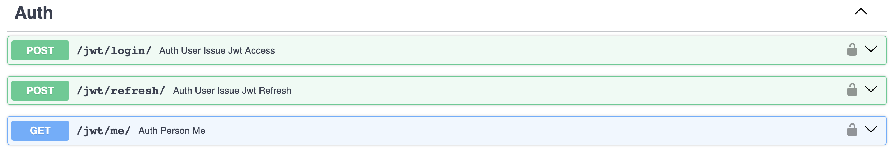
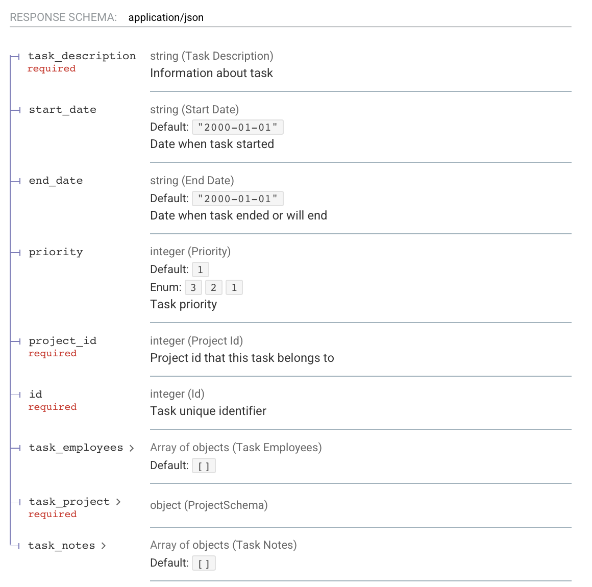

# 🚀 FastAPI Асинхронный Бэкенд Проект

[English](#-fastapi-asynchronous-backend-project) | **Русский**

Высокопроизводительное асинхронное бэкенд-приложение с современным стеком технологий и полным циклом разработки.

## 🖼️ Project Demo

### API Documentation

*Интерактивное API документация со всеми эндпоинтами*

### Database Schema

*PostgreSQL схема показывающиеся все связи*

### Key Features
 # авторизация 
 response schema 'get task' с one2many и one2one связями
 # Возможность загружать собственные данные

### 🚀 Quick Local Setup
```bash
git clone https://github.com/Emin-07/Project-Handler.git
make run
# App runs on http://localhost:8000
# API docs: http://localhost:8000/docs 
# API alternative docs: http://localhost:8000/redoc 

```


## 🛠 Технологический стек

**Бэкенд:**
- **Python 3.13** - Основной язык программирования
- **FastAPI 0.116** - Современный асинхронный фреймворк
- **SQLAlchemy 2.0** - Асинхронный ORM
- **Alembic** - Миграции базы данных
- **Pydantic & Pydantic Settings** - Валидация и конфигурация
- **Uvicorn** - ASGI сервер

**База данных:**
- **PostgreSQL** - Основная реляционная БД
- **AsyncPG** - Асинхронный драйвер PostgreSQL
- **Psycopg2** - Дополнительный драйвер БД

**Инфраструктура:**
- **Docker & Docker Compose** - Контейнеризация и оркестрация
- **UV** - Современный менеджер зависимостей
- **Pytest** - Фреймворк для тестирования
- **HTTPX** - Асинхронные HTTP клиенты

**Инструменты разработки:**
- **Ruff** - Молниеносный линтер
- **Mypy** - Статическая проверка типов
- **Black** - Форматирование кода
- **Pre-commit** - Git hooks

## 🚀 Быстрый старт

### Предварительные требования
- Docker & Docker Compose
- UV (рекомендуется) или Python 3.13+

### Запуск через Docker (Рекомендуется)
```bash
# Клонировать репозиторий
git clone https://github.com/Emin-07/Project-Handler.git
cd projectHandler

# Запустить все сервисы
make run

# Приложение FastAPI будет доступно по http://localhost:8000
# Приложение Adminer будет доступно по http://localhost:8080
# Приложение pgadmin будет доступно по http://localhost:5050

```

### Локальная разработка с UV
```bash
# Установить UV (если не установлен)
curl -LsSf https://astral.sh/uv/install.sh | sh

# Клонировать и настроить
git clone https://github.com/Emin-07/Project-Handler.git
cd projectHandler

# Установить все зависимости
uv sync --all-extras

# Сгенерировать requirements файлы
make requirements

# Запустить сервер разработки
uvicorn main:app --reload --host 0.0.0.0 --port 8000
```

### Традиционный способ (pip)
```bash
# Сгенерировать requirements.txt
make requirements

# Создать виртуальное окружение
python -m venv venv
source venv/bin/activate

# Установить зависимости
pip install -r requirements.txt
pip install -r requirements-dev.txt


# Запустить сервер
uvicorn app.main:app --reload --host 0.0.0.0 --port 8000
```

## 📡 API Эндпоинты

### Основные endpoints:
- `GET /health` -(in process) Проверка работоспособности API
- `GET /docs` - Интерактивная документация Swagger
- `GET /redoc` - Альтернативная документация

### Особенности API:
- ✅ **Полностью асинхронные операции**
- ✅ **Автогенерация документации OpenAPI**
- ✅ **Валидация данных через Pydantic v2**
- ✅ **JWT аутентификация**
- ✅ **Пагинация и фильтрация**
- ✅ **Обработка ошибок и валидация**

## 🧪 Тестирование

```bash
# Запуск всех тестов
make test


# Запуск конкретного теста
pytest tests/ -v -k "test_function_name"
```

**Покрытие тестами:**
- Модульные тесты (Unit tests)
- Интеграционные тесты с базой данных
- Тесты API эндпоинтов
- Асинхронные тесты (pytest-asyncio)

## 🗄 Структура проекта

```
project/
├── src/
│   ├── routers/         # Роутеры и endpoints
│   ├── database/        # Задачи относящиеся к базе данных
│   │   ├── connections/ # SQLAlchemy модели БД, Конфиг БД и сетап БД
│   │   ├── queries/     # Запросы написаны на SQLAlchemy ORM для взаимодейcтвия с БД
│   ├── schemas/         # Pydantic схемы для валидации
│   └── tests/           # Тесты
├── alembic/             # Alembic миграции
├── images_for_readme/              # Фото использованные для readme
├── README.md            # Readme для GitHub
├── env.example          # Пример .env файла который поможет вам в настройке окружения
├── test_data.json       # Дата для теста ручек
├── user_data.json       # Дата для работы с ручками, данная юзером
├── prestart.sh          # Файл запускающийся в докерфайле, он обновляет миграции до Head
├── main.py              # Файл содержащий root endpointы, и связывающий routerы
├── pytest.ini           # Настройки для pytest (тестинга)
├── alembic.ini          # Настройки для alembic (миграции)
├── uv.lock              # Файл который следит за всеми зависимостями
├── .gitignore           # Файл позволяющий игнорировать ненужные файлы при коммите
├── docker-compose.yml   # Docker конфигурация
├── Dockerfile           # Образ приложения
├── pyproject.toml       # Зависимости UV
├── requirements.txt     # Автогенерируемые зависимости
├── requirements-dev.txt # Автогенерируемые зависимости для dev
└── Makefile             # Утилиты разработки
```

## 🔧 Настройка окружения

Создайте `.env` файл:

# Linux/Mac
cp .env.example .env

# Windows (Command Prompt)
copy .env.example .env

```env
DB_HOST=localhost
DB_PORT=5433
DB_USER=postgres
DB_PASSWORD=postgres
DB_NAME=project_handler
```

## 👨‍💻 Разработка

### Управление зависимостями
```bash
# Добавить новую зависимость
uv add package_name

# Добавить dev зависимость
uv add --dev package_name

# Обновить requirements файлы
make requirements
```

### Миграции базы данных
```bash
# Создать новую миграцию
alembic revision --autogenerate -m "description"

# Применить миграции
alembic upgrade head

# Откатить миграцию
alembic downgrade -1
```

### Code Quality
```bash
# Запуск линтера и форматирование
ruff check .
ruff format .

# Проверка типов
mypy app/
```

### Утилиты Makefile
```bash
make requirements       # Скачивание всех зависимостей, как dev так и prod
make requirements-prod  # Скачивание prod зависимостей
make requirements-dev   # Скачивание dev зависимостей
make run                # Запуск через Docker-compose
make test               # Запуск тестов
make demo               # Демо окружение
make down               # Остановка контейнеров
make clean              # Очистка проекта

```


## 📈 Производительность

Благодаря современному асинхронному стеку:
- **FastAPI** для высокопроизводительных запросов
- **AsyncPG** для асинхронного доступа к PostgreSQL
- **UV** для быстрой установки зависимостей
- **Ruff** для мгновенного линтинга
- **Docker** для изоляции и масштабирования

---

# 🚀 FastAPI Asynchronous Backend Project

**Russian** | [English](#-fastapi-asynchronous-backend-project)

High-performance asynchronous backend application with a modern technology stack and full development cycle.

## 🖼️ Project Demo

### API Documentation

*Interactive API documentation with all endpoints*

### Database Schema

*PostgreSQL schema showing all relationships*

### Key Features
 # Authorization (This feature is in progress)
 Response schema for 'get task' with one2many and one2one relationships
 # Ability to upload custom data

### 🚀 Quick Local Setup
```bash
git clone https://github.com/Emin-07/Project-Handler.git
make run
# App runs on http://localhost:8000
# API docs: http://localhost:8000/docs
# API alternative docs: http://localhost:8000/redoc
```

## 🛠 Technology Stack

**Backend:**
- **Python 3.13** - Main programming language
- **FastAPI 0.116** - Modern asynchronous framework
- **SQLAlchemy 2.0** - Asynchronous ORM
- **Alembic** - Database migrations
- **Pydantic & Pydantic Settings** - Validation and configuration
- **Uvicorn** - ASGI server

**Database:**
- **PostgreSQL** - Main relational database
- **AsyncPG** - Asynchronous PostgreSQL driver
- **Psycopg2** - Additional database driver

**Infrastructure:**
- **Docker & Docker Compose** - Containerization and orchestration
- **UV** - Modern dependency manager
- **Pytest** - Testing framework
- **HTTPX** - Asynchronous HTTP clients

**Development Tools:**
- **Ruff** - Blazing-fast linter
- **Mypy** - Static type checking
- **Black** - Code formatting
- **Pre-commit** - Git hooks

## 🚀 Quick Start

### Prerequisites
- Docker & Docker Compose
- UV (recommended) or Python 3.13+

### Running via Docker (Recommended)
```bash
# Clone the repository
git clone https://github.com/Emin-07/Project-Handler.git
cd projectHandler

# Start all services
make run

# FastAPI app will be available at http://localhost:8000
# Adminer app will be available at http://localhost:8080
# pgAdmin app will be available at http://localhost:5050
```

### Local Development with UV
```bash
# Install UV (if not installed)
curl -LsSf https://astral.sh/uv/install.sh | sh

# Clone and setup
git clone https://github.com/Emin-07/Project-Handler.git
cd projectHandler

# Install all dependencies
uv sync --all-extras

# Generate requirements files
make requirements

# Run the development server
uvicorn main:app --reload --host 0.0.0.0 --port 8000
```

### Traditional Method (pip)
```bash
# Generate requirements.txt
make requirements

# Create a virtual environment
python -m venv venv
source venv/bin/activate

# Install dependencies
pip install -r requirements.txt
pip install -r requirements-dev.txt

# Start the server
uvicorn app.main:app --reload --host 0.0.0.0 --port 8000
```

## 📡 API Endpoints

### Main endpoints:
- `GET /health` -(in process) API health check
- `GET /docs` - Interactive Swagger documentation
- `GET /redoc` - Alternative documentation

### API Features:
- ✅ **Fully asynchronous operations**
- ✅ **Auto-generated OpenAPI documentation**
- ✅ **Data validation via Pydantic v2**
- ✅ **JWT authentication**
- ✅ **Pagination and filtering**
- ✅ **Error handling and validation**

## 🧪 Testing

```bash
# Run all tests
make test

# Run a specific test
pytest tests/ -v -k "test_function_name"
```

**Test Coverage:**
- Unit tests
- Database integration tests
- API endpoint tests
- Asynchronous tests (pytest-asyncio)

## 🗄 Project Structure

```
project/
├── src/
│   ├── routers/         # Routers and endpoints
│   ├── database/        # Database-related tasks
│   │   ├── connections/ # SQLAlchemy DB models, DB config and DB setup
│   │   ├── queries/     # Queries written in SQLAlchemy ORM for DB interaction
│   ├── schemas/         # Pydantic schemas for validation
│   └── tests/           # Tests
├── alembic/             # Alembic migrations
├── images_for_readme/              # Images_for_readme used for readme
├── README.md            # GitHub Readme
├── env.example          # Example .env file to help with environment setup
├── test_data.json       # Test data for endpoints
├── user_data.json       # User-provided data for working with endpoints
├── prestart.sh          # File run in the Dockerfile, updates migrations to Head
├── main.py              # File containing root endpoints and connecting routers
├── pytest.ini           # Settings for pytest (testing)
├── alembic.ini          # Settings for alembic (migrations)
├── uv.lock              # File tracking all dependencies
├── .gitignore           # File for ignoring unnecessary files during commits
├── docker-compose.yml   # Docker configuration
├── Dockerfile           # Application image
├── pyproject.toml       # UV dependencies
├── requirements.txt     # Auto-generated dependencies
├── requirements-dev.txt # Auto-generated dev dependencies
└── Makefile             # Development utilities
```

## 🔧 Environment Setup

Create a `.env` file:

# Linux/Mac
cp .env.example .env

# Windows (Command Prompt)
copy .env.example .env

```env
DB_HOST=localhost
DB_PORT=5433
DB_USER=postgres
DB_PASSWORD=postgres
DB_NAME=project_handler
```

## 👨‍💻 Development

### Dependency Management
```bash
# Add a new dependency
uv add package_name

# Add a dev dependency
uv add --dev package_name

# Update requirements files
make requirements
```

### Database Migrations
```bash
# Create a new migration
alembic revision --autogenerate -m "description"

# Apply migrations
alembic upgrade head

# Rollback a migration
alembic downgrade -1
```

### Code Quality
```bash
# Run linter and formatting
ruff check .
ruff format .

# Type checking
mypy app/
```

### Makefile Utilities
```bash
make requirements       # Download all dependencies, both dev and prod
make requirements-prod  # Download prod dependencies
make requirements-dev   # Download dev dependencies
make run                # Run via Docker-compose
make test               # Run tests
make demo               # Demo environment
make down               # Stop containers
make clean              # Clean the project
```

## 📈 Performance

Thanks to the modern asynchronous stack:
- **FastAPI** for high-performance requests
- **AsyncPG** for asynchronous PostgreSQL access
- **UV** for fast dependency installation
- **Ruff** for instant linting
- **Docker** for isolation and scaling

---